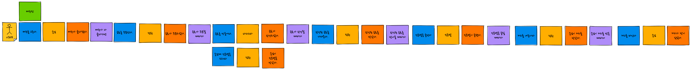
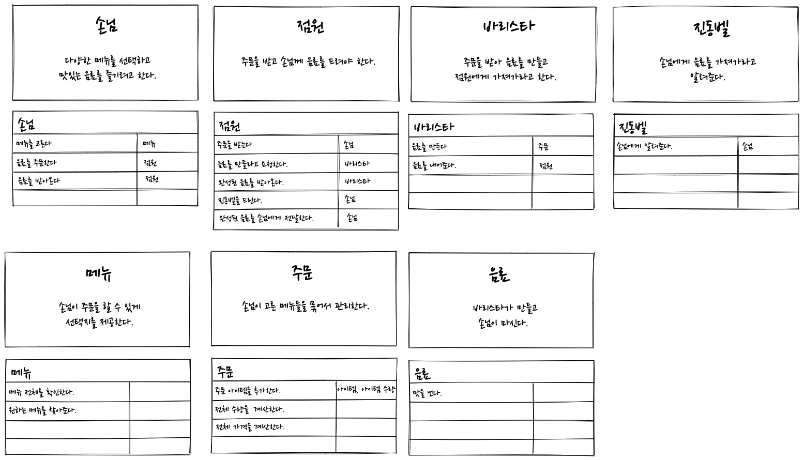
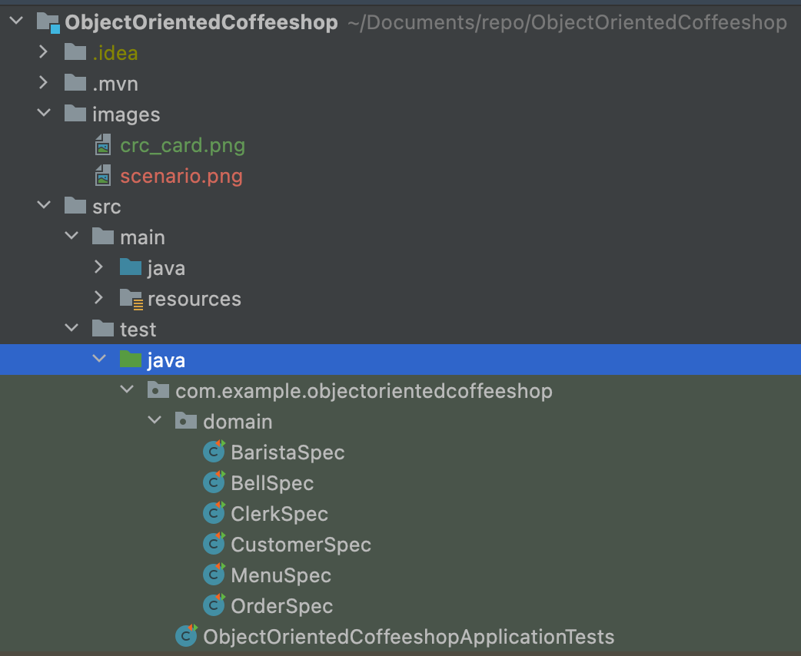
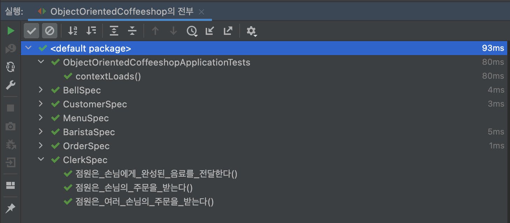

# 객체지향 커피샵 예제

이 Repository는 아래 시나리오를 객체지향으로 모델링해 본 것입니다.

## 시나리오

1. 손님이 메뉴를 보고 마시고 싶은 메뉴를 선택합니다. (여러 개 가능)
2. 손님은 메뉴를 다 고르면 점원에게 음료를 주문합니다.
3. 점원은 음료를 주문 받으면
   1. 바리스타에게 주문을 전달하고 음료를 만들게 합니다.
   2. 손님에게 진동벨을 줍니다.
4. 바리스타는 주문 받은 음료를 만듭니다.
5. 음료가 완성되면 바리스타는 점원에게 음료가 완성되었다고 알려줍니다.
6. 점원은 완성된 음료를 받아온 뒤에 진동벨을 울려서 손님을 부릅니다.
7. 손님은 진동벨이 울리면 점원에게 가서 음료를 받아옵니다.
8. 손님은 음료를 맛있게 즐깁니다.

## CRC 카드
위 시나리오를 가지고 CRC 카드를 만들어 보았습니다.

## 실행해보기

아직은 도메인 영역 밖에 없기 때문에 JUnit 테스트로 실행합니다.

정상적으로 실행된다면 테스트 결과가 다음과 같이 보일 것입니다.

domain 패키지에 있는 클래스들을 잘 살펴보시고 그들이 어떤 책임을 가지고 있는지, 어떻게 협력하는지를 CRC 카드와 비교하여 파악해보세요.
